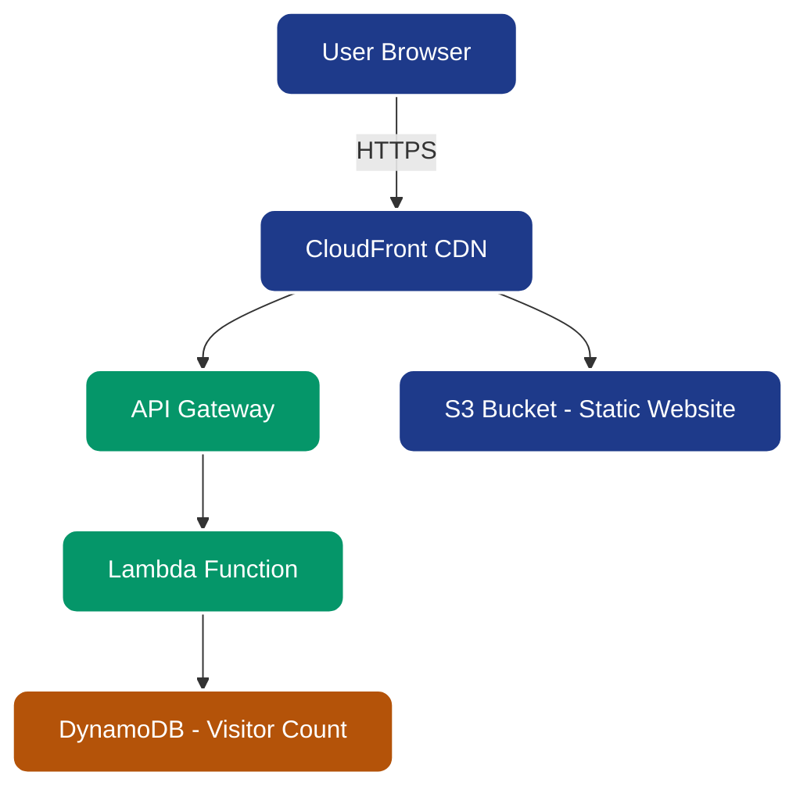

# 🌩️ AWS Cloud Resume Challenge  

  
  
  

This repository contains my implementation of the **The Cloud Resume Challenge**.  
The project combines **frontend, backend, AWS serverless services, Infrastructure as Code, and CI/CD** into a full-stack cloud deployment.  

---

## 📑 Table of Contents

- [Overview](#overview)  
- [Features](#features)  
- [Architecture](#architecture)  
- [Tech Stack](#tech-stack)  
- [Deployment](#deployment)  
- [Challenges](#challenges)  
- [Demo](#demo)  
- [Author](#author)  

---

## 🔎 Overview

The **Cloud Resume Challenge** demonstrates cloud, DevOps, and serverless skills by building a resume website hosted entirely on AWS.  

It includes:  
✅ Static resume website hosted on AWS  
✅ Global HTTPS distribution via CloudFront  
✅ Visitor counter using a serverless backend  
✅ Infrastructure defined as code  
✅ Automated deployments via CI/CD  

---

## ✨ Features

- Responsive static resume website  
- Custom domain with HTTPS (via ACM + Route 53)  
- Visitor counter (DynamoDB + Lambda + API Gateway)  
- CI/CD pipeline for automated deployments  
- Infrastructure as Code for reproducibility  

---

## 🏗️ Architecture

---

## 🛠️ Tech Stack

- **Frontend:** HTML, CSS, JavaScript  
- **Backend:** Python (AWS Lambda)  
- **Database:** DynamoDB  
- **Infrastructure as Code:** Terraform / SAM / CloudFormation  
- **CI/CD:** GitHub Actions  
- **AWS Services:** S3, CloudFront, Route 53, ACM, API Gateway, DynamoDB, Lambda, IAM

---

## 🚀 Deployment

### Frontend

- Host static files (HTML, CSS, JS) in S3
- Distribute globally via CloudFront
- Secure with ACM SSL Certificate
- Route custom domain with Route 53

### Backend

- Create DynamoDB table to store visitor count
- Write Lambda function (Python) for logic
- Deploy API Gateway endpoint to expose Lambda
- Enable CORS for frontend JS integration

### Infrastructure as Code

- Define resources with Terraform / SAM / CloudFormation
- Deploy reproducibly with a single command

### CI/CD

- GitHub Actions pipeline:
  - Deploy frontend to S3
  - Deploy backend to Lambda
  - Invalidate CloudFront cache automatically

---

## ⚡ Challenges

- Configuring HTTPS and certificate propagation  
- Handling CORS issues with API Gateway  
- IAM permissions for Lambda and DynamoDB  
- Automating CloudFront cache invalidations

---

🎥 Demo

👉 [Live Website](https://dc6hmt6okrq1a.cloudfront.net)

